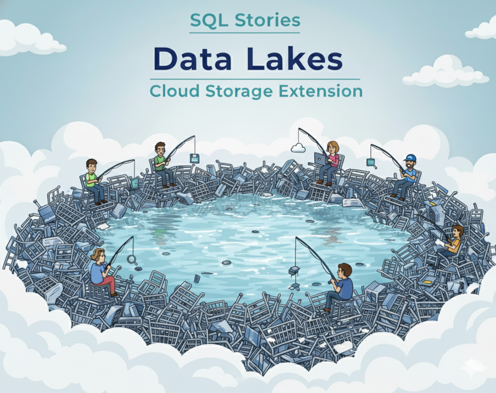

<p align="center">
  <sub>ecom-datalake-extension · Synthetic data lake delivery toolkit</sub>
</p>
<p align="center">
  
  <br>
  <em>Generate · Partition · Publish — your synthetic lake delivery kit.</em>
</p>

<p align="center">
  <a href="https://github.com/G-Schumacher44/ecom-datalake-exten/actions/workflows/ci.yml">
    
  </a>
  
  
  
</p>

---

# ecom-datalake-extension
- The `ecomlake` CLI wraps the `ecom_sales_data_generator` engine so it ships clean CSVs into partitioned Parquet.
- Adds lineage metadata (`event_id`, `batch_id`, `ingestion_ts`, `source_file`) and `_MANIFEST` + `_SUCCESS` markers.
- Pushes partitions straight to Google Cloud Storage using Application Default Credentials or service-account keys.
- Built to plug into the broader automation project—this repo stays focused on lake hydration only.

___

## 🧩 TLDR;

- `ecomlake run-generator`: invoke the generator with a YAML config.
- `ecomlake export-raw`: convert CSV output → Hive-partitioned Parquet with manifests.
- `ecomlake upload-raw`: publish partitions to `gs://<bucket>/<prefix>/<table>/ingest_dt=YYYY-MM-DD`.
- Multi-date exports, manifest checksums/row counts, and post-export hooks baked in.
- Batteries included: smoke-test config, pytest suite, Conda env, lint/CI tooling.

<details>
<summary> ⏯️ Quick Start</summary>

1. Clone the repository *(or install directly from git)*  
   ```bash
   git clone https://github.com/G-Schumacher44/ecom-datalake-exten.git
   cd ecom-datalake-exten

   # or skip cloning and install straight into an env:
   pip install git+https://github.com/G-Schumacher44/ecom-datalake-exten.git[gcs]
   ```

2. Run the CLI      
    ```bash
    conda env create -f environment.yml
    conda activate ecom-datalake-exten

    pip install -e '.[gcs]'
    pip install -e '../ecom_sales_data_generator'
    # or install from git when integrating elsewhere:
    # pip install git+https://github.com/G-Schumacher44/ecom-datalake-exten.git[gcs]

    ecomlake run-generator \
      --config gen_config/ecom_sales_gen_quick.yaml \
      --artifact-root artifacts \
      --messiness-level none \
      --generator-src ../ecom_sales_data_generator/src

    ecomlake export-raw \
      --source artifacts/raw_run_<TIMESTAMP> \
      --target output/raw \
      --ingest-date 2024-02-15

    ecomlake upload-raw \
      --source output/raw \
      --bucket gcs-automation-project-raw \
      --prefix ecom/raw \
      --ingest-date 2024-02-15
    ```
</details>

---

## 📐 What’s Included

- Click-based CLI (`ecomlake`) with generator, export, and upload commands.
- Partitioned Parquet writer with configurable target size and lineage enrichment.
- Manifests + `_SUCCESS` markers ready for downstream automation.
- GCS uploader with dry-run, table filters, and reusable credential strategy.
- Quick-run YAML config to generate a 60-day backlog for smoke testing.
- Post-export hook system so you can trigger custom logic after each partition (**QA summaries**, **data alerts**, **custom metrics**).


### 🧭 Orientation & Getting Started

<details>
<summary><strong>🧠 Notes from the Dev Team</strong></summary>
<br>

I built this CLI as a drop-in task for Cloud Run and Cloud Scheduler. The data generator repo handles logic, while this one handles lake plumbing — transforming raw CSVs into structured Parquet and pushing them to cloud storage with clean lineage.

Everything stays modular and agnostic by design. Swap out buckets, prefixes, or configs, and it just works. No code rewrites, no hidden dependencies — just lightweight, portable lake hydration..

</details>

<details><summary><strong>📚 Resource Hub Links</strong></summary>
<br>

- **Lake Resources**
  - [Lake Config Guide](docs/resource_hub/datalakes_extention/CONFIG_GUIDE.md)
  - [Testing Guide](docs/resource_hub/datalakes_extention/TESTING_GUIDE.md)
- **Workflow Playbooks**
  - [Backlog Bear · 5-Year Bronze Backfill](docs/resource_hub/datalakes_extention/workflows/BACKLOG_BEAR.md)
- **Generator Resources**
  - [Generator README](docs/resource_hub/README_generator.md)
  - [Generator Config Guide](docs/resource_hub/CONFIG_GUIDE_generator.md)
  - [Database Schema Reference](docs/resource_hub/database_schema_reference.md)

</details>

<details>

<summary><strong>🗺️ About the Project Ecosystem</strong></summary>

This repository is one part of a larger, interconnected set of projects. Here’s how they fit together:

* **ecom_sales_data_generator** `(The Engine)`  
  Generates realistic, relational ecommerce datasets. This extension imports it and keeps that repo focused on synthesis.
* **ecom-datalake-exten** `(This Repo · The Lake Layer)`  
  Converts generator output to Parquet, attaches lineage, and publishes to raw/bronze buckets.
* **Automation repo** `(The Orchestrator)`  
  Schedules backlog + streaming-style runs, triggers BigQuery loads/merges, and manages downstream DAGs.

</details>

<details>
<summary><strong>🫆 Version Release Notes</strong></summary>

### ✅ v0.1.0 (Current)
- Multi-date exports with enriched manifests (row counts + checksums).
- Post-export hook framework for custom QA/metrics.
- CLI lint/CI pipeline, black/ruff configuration, and pre-commit support.
- Resource hub documentation for configs, schema, and generator usage.

</details>

<details>
<summary><strong>💪 Future State</strong></summary>

- Auto-tune partition sizing: expose a flag that sets target Parquet filesize by MB and automatically adjusts rows-per-chunk per table so users don’t have to tweak YAML volumes for file sizing.
- Improve usability checks: add a “doctor” command or pre-flight validator that confirms config files exist, the generator package is importable, output directories are writable, and GCS credentials are present before running full flows.

</details>

<details>
<summary>⚙️ Project Structure</summary>

```
ecom-datalake-exten/
├── docs/
│   └── img/
│       └── datalakes_banner.png
├── gen_config/
│   ├── ecom_sales_gen_quick.yaml
│   └── ecom_sales_gen_template.yaml
├── src/
│   └── ecom_datalake_extension/
│       ├── __init__.py
│       ├── cli.py
│       ├── config.py
│       ├── gcs_uploader.py
│       ├── generator_runner.py
│       ├── lineage.py
│       ├── manifest.py
│       ├── parquet_writer.py
│       └── utils.py
├── tests/
│   ├── test_cli_export.py
│   ├── test_gcs_upload.py
│   └── test_parquet_writer.py
├── environment.yml
├── pyproject.toml
└── README.md
```

</details>

<details>

<summary><strong>🔍 Smoke Test Artifacts</strong></summary> 

- `artifacts/` and `output/` are ignored in git and hold generator CSV + Parquet exports.
- Use `gen_config/ecom_sales_gen_quick.yaml` for fast local runs; swap in the full template for production-scale backlogs.

</details>

<details>

<summary>🛠️ Basic Troubleshooting</summary>

- `ModuleNotFoundError: tests.qa_tests`: install the generator repo (`pip install -e ../ecom_sales_data_generator`) or pass `--generator-src ../ecom_sales_data_generator/src`.
- `google-cloud-storage` missing: install extra (`pip install -e '.[gcs]'`) or work in dry-run mode.
- Upload auth issues: run `gcloud auth application-default login` or set `GOOGLE_APPLICATION_CREDENTIALS` to a service-account JSON fetched from Secret Manager.

</details>

---

## ▶️ Setup 

### 🔩 Configuration Setup

Use the YAML-based configuration system to control the size, structure, and messiness of your generated data.

<details>
<summary><strong>Key knobs</strong></summary>

- `lookup_config` controls customers/products volume.
- `parameters.order_days_back` defines backlog length (default 60 days in quick config).
- `parameters.conversion_rate`, `seasonal_factors`, and `return_rate` tune realism.

</details>

<details>
<summary><strong>Smoke-test config</strong></summary>

- `gen_config/ecom_sales_gen_quick.yaml` keeps runtime light (~60 day history, ~6k customers, ~12k carts).
- The full template mirrors the generator repo’s production settings (1-year history, larger volumes).

</details>

### 📦 Dev Setup
<details>
<summary><strong>Editable install (recommended)</strong></summary>
<br>

```bash
conda env create -f environment.yml
conda activate ecom-datalake-exten
pip install -e '.[gcs]'
pip install -e '../ecom_sales_data_generator'
pip install pre-commit
pre-commit install
```

</details>

<details>
<summary><strong>Pure pip / virtualenv option</strong></summary>
<br>

```bash
python -m venv .venv
source .venv/bin/activate
pip install -e '.[gcs]'
pip install -e '../ecom_sales_data_generator'
```

</details>

___

### ▶️ CLI Usage
<details>
<summary><strong>Generate CSV artifacts</strong></summary>
<br>

```bash
ecomlake run-generator \
  --config gen_config/ecom_sales_gen_quick.yaml \
  --artifact-root artifacts \
  --messiness-level none \
  --generator-src ../ecom_sales_data_generator/src
```

</details>

<details>
<summary><strong>Convert to Parquet + manifest</strong></summary>
<br>

```bash
ecomlake export-raw \
  --source artifacts/raw_run_20251019T173945Z \
  --target output/raw \
  --ingest-date 2024-02-15 \
  --target-size-mb 10

# or run multiple partitions in one shot
ecomlake export-raw \
  --source artifacts/raw_run_20251019T173945Z \
  --target output/raw \
  --dates 2024-02-15,2024-02-16 \
  --post-export-hook analytics.metrics:record_partition
```

</details>

<details>
<summary><strong>Publish to Google Cloud Storage</strong></summary>
<br>

```bash
gcloud auth application-default login  # or set GOOGLE_APPLICATION_CREDENTIALS
ecomlake upload-raw \
  --source output/raw \
  --bucket gcs-automation-project-raw \
  --prefix ecom/raw \
  --ingest-date 2024-02-15 \
  --dry-run  # remove flag when ready to push
# resulting GCS path: gs://gcs-automation-project-raw/ecom/raw/orders/ingest_dt=2024-02-15/
```

</details>

<details>
<summary><strong>Trigger a post-export hook</strong></summary>
<br>

```bash
ecomlake export-raw \
  --source artifacts/raw_run_<TIMESTAMP> \
  --target output/raw \
  --ingest-date 2024-02-15 \
  --post-export-hook analytics.metrics:record_partition
```

</details>

___

## 🧪 Testing and Validation Guide

<details>
<summary>🎯 Test Objectives</summary>

- Validate Parquet writer adds lineage columns and event-date metadata.
- Ensure CLI export command emits `_SUCCESS` + `_MANIFEST` and Parquet with event IDs.
- Mock upload flow so GCS credentials are never required in tests.

</details>

<details>
<summary>🛠️ Running the Tests</summary>

```bash
pip install -e '.[dev]'
pytest
```

</details>

___

## 🤝 On Generative AI Use

Generative AI tools (Gemini 2.5-PRO, ChatGPT 4o - 4.1) were used throughout this project as part of an integrated workflow — supporting code generation, documentation refinement, and idea testing. These tools accelerated development, but the logic, structure, and documentation reflect intentional, human-led design. This repository reflects a collaborative process: where automation supports clarity, and iteration deepens understanding.

---

## 📦 Licensing

This project is licensed under the [MIT License](LICENSE).

___

<p align="center">
  <a href="README.md">🏠 <b>Home</b></a>
  &nbsp;·&nbsp;
  <a href="docs/resource_hub/datalakes_extention/CONFIG_GUIDE.md">⚙️ <b>Config Guide</b></a>
  &nbsp;·&nbsp;
  <a href="docs/resource_hub/datalakes_extention/TESTING_GUIDE.md">🧪 <b>Testing Guide</b></a>
</p>

<p align="center">
  <sub>✨ Build the lake. Tell the story. ✨</sub>
</p>
