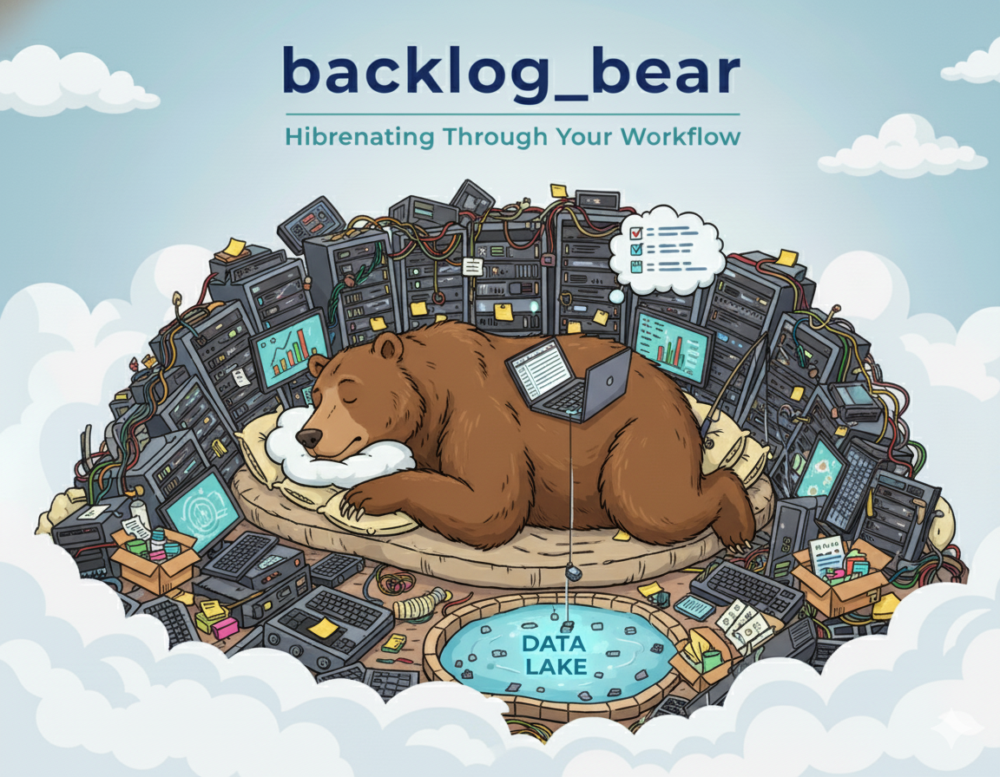

<p align="center">
  
  <br>
  <em>5-year raw-zone backlog automation workflow.</em>
</p>

---

# 🧸 Backlog Bear Workflow Playbook

This playbook documents the Backlog Bear workflow for hydrating the bronze/raw zone with five years of
weekly partitions. It captures the exact steps the automation script executes so you can run it
confidently and repeatably.

---

## 🎯 Objective

- Generate medium mess synthetic CSVs with the ecom generator
- Convert each weekly slice into partitioned Parquet with manifests
- Upload those partitions to the raw GCS bucket (`stage/bronze`)
- Clean up local staging artifacts between iterations

By default the playbook covers **2020-01-01 → 2024-12-31** (five calendar years) in **weekly** chunks.

---

## ✅ Prerequisites

```bash
conda activate ecom-datalake-exten
pip install -e '.[gcs]'
pip install -e '../ecom_sales_data_generator'  # or install from git
gcloud auth application-default login          # or export GOOGLE_APPLICATION_CREDENTIALS
```

Also ensure the destination bucket (`gs://gcs-automation-project-raw/ecom/raw`) exists and that you have
enough local disk space for temporary Parquet output (`artifacts/`, `output/raw/`).

---

## ⚙️ Script Location & Parameters

The automation lives at `scripts/backlog_bear.sh` and ships with sensible defaults:

| Variable                  | Description                               | Default                                |
| ------------------------- | ----------------------------------------- | -------------------------------------- |
| `CONFIG_PATH`             | Generator YAML driving behavior           | `gen_config/ecom_sales_gen_quick.yaml` |
| `ARTIFACT_ROOT`           | Location for generator CSV runs           | `artifacts`                            |
| `TARGET_ROOT`             | Parquet landing zone prior to upload      | `output/raw`                           |
| `BUCKET`                  | Raw bucket (no `gs://`)                   | `gcs-automation-project-raw`           |
| `PREFIX`                  | Path prefix inside the bucket             | `ecom/raw`                             |
| `MESSINESS_LEVEL`         | Generator realism level                   | `medium_mess`                          |
| `START_DATE` / `END_DATE` | Five-year range                           | `2020-01-01` → `2024-12-31`            |
| `CHUNK_SIZE`              | Days per iteration (weekly cadence)       | `7`                                    |
| `POST_EXPORT_HOOK`        | Optional hook for extra manifest handling | `""`                                   |

Tune them at the top of the script before launch.

---

## 🤖 Running the Workflow

```bash
# optional but recommended: keep the Mac awake
caffeinate -dims &

# run inside tmux or screen so the session survives disconnects
tmux new -s backlog_bear

./scripts/backlog_bear.sh
```

The script logs progress for each weekly window:

1. Generate CSVs with `ecomlake run-generator`
2. Export the week to Parquet (`ecomlake export-raw`) with a shared batch ID
3. Upload every day within the week to GCS (`ecomlake upload-raw`)
4. Remove the processed raw run directory and advance to the next week

Stop the run with `Ctrl+C` at any time. To resume, adjust `START_DATE` to the next unprocessed week and rerun.

---

## 🧪 Verification Checklist

- `gsutil ls -r gs://gcs-automation-project-raw/ecom/raw/orders | head`
- `_MANIFEST.json` exists for each `ingest_dt=YYYY-MM-DD`
- Spot-read Parquet locally: `python -c "import pandas as pd; print(pd.read_parquet('output/raw/orders/ingest_dt=2020-01-01/part-0000.parquet').head())"`
- Storage footprint: `gcloud storage du gs://gcs-automation-project-raw --recursive --summarize --human-readable`

Expect ~13–20 GB of Parquet after the full five-year backlog, costing well under $1/month in most regions.

---

## 🚨 Troubleshooting & Tuning

- **Slow progress?** Increase `CHUNK_SIZE` to process multiple weeks at once or cut generator volumes
  inside `gen_config/ecom_sales_gen_quick.yaml`.
- **Want CSV runs preserved?** Comment out the `rm -rf "$latest_run"` line and manage disk space manually.
- **Dry-run uploads:** add `--dry-run` to the `ecomlake upload-raw` call inside the loop.
- **Authentication issues:** rerun `gcloud auth application-default login` or point `GOOGLE_APPLICATION_CREDENTIALS` at a service-account key.

___

_Future workflows (silver transforms, QA sweeps, scheduled refreshes) belong in this `workflows/` hub
alongside Backlog Bear._

<p align="center">
  <a href="../../../../README.md">🏠 <b>Home</b></a>
  &nbsp;·&nbsp;
  <a href="../CONFIG_GUIDE.md">⚙️ <b>Lake Config</b></a>
  &nbsp;·&nbsp;
  <a href="../TESTING_GUIDE.md">🧪 <b>Testing</b></a>
  &nbsp;·&nbsp;
  <a href="../../CONFIG_GUIDE_generator.md">🛠️ <b>Generator Config</b></a>
</p>
